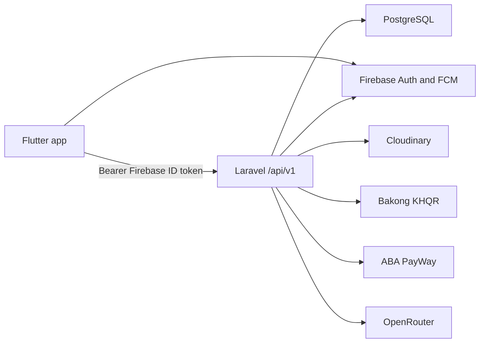

# GoITC

GoITC is a campus event-ticketing app. Guests can browse published events. Attendees can sign in, save events, book or pay for a ticket, and present a QR code at the door. Admins use the same Flutter app to publish events, check people in, and review attendance.

The client is Flutter (English and Khmer, light and dark themes). The API is Laravel with PostgreSQL. Times are in `Asia/Phnom_Penh`.

## Who uses it

| Role | What they can do |
| --- | --- |
| **Guest** | Browse published events and open event details without signing in. |
| **Attendee** | Sign in with Firebase (email/password, Google, or phone/SMS), complete a campus profile, save events, reserve a free ticket or pay for a paid event, view QR tickets, receive notifications, and ask the in-app assistant. |
| **Admin** | Everything an attendee can, plus create/edit/publish/cancel events, set a cover image, view attendees, scan QR tickets or enter codes manually, and open the KPI dashboard. Admin access is `users.is_admin` in PostgreSQL, not a Firebase claim. |


## Features

- Event list and detail, with an optional Cloudinary cover (or a placeholder)
- Capacity-enforced reservations and QR tickets
- Paid checkout with Bakong KHQR and ABA PayWay (sandbox)
- Saved events, campus profile, and bilingual UI
- Push notifications (FCM) and an in-app inbox
- Maps and directions to the venue
- AI chat assistant (OpenRouter)
- Admin check-in (camera scan or manual code) with attempt logs
- Admin KPI charts

## Architecture



Flutter signs the user in with Firebase, then calls Laravel with the ID token. Laravel verifies the token, syncs the user, and enforces guest / attendee / admin rules. Cover images go to Cloudinary. Payments go through Bakong or PayWay. Chat is proxied through OpenRouter.

## Repository

```
.
├── backend/            Laravel REST API
├── mobile/             Flutter app (attendee + admin)
├── docs/               Spec, schema, payment sequence
└── docker-compose.yml  PostgreSQL for local development
```

## Prerequisites

- PHP 8.3+
- Composer
- Node.js and npm
- Docker (or a local PostgreSQL 16)
- Flutter SDK ^3.12.2
- A Firebase project with Android and iOS apps (email/password, Google, and phone auth)


## Local setup

### 1. PostgreSQL

```bash
docker compose up -d
```

Compose publishes Postgres on host port **5432**. Copy the database name, user, and password from [`docker-compose.yml`](docker-compose.yml) into `backend/.env`.

[`backend/.env.example`](backend/.env.example) defaults to `DB_PORT=5432`. If you use Compose, set `DB_PORT=5432`.

### 2. Backend

```bash
cd backend
composer setup
```

`composer setup` installs PHP and Node dependencies, copies `.env` if missing, generates `APP_KEY`, runs migrations, and builds frontend assets.

Then edit `backend/.env`:

- Match Docker DB settings (including `DB_PORT=5432`)
- Set `FIREBASE_CREDENTIALS` to the absolute path of your Firebase service-account JSON
- Fill in Cloudinary, OpenRouter, Bakong, and PayWay keys if you need those features

Seed sample events and an admin row:

```bash
php artisan db:seed
```

See [`backend/database/seeders/`](backend/database/seeders/) for what gets created. Admin access is stored as `is_admin` in Postgres. The seeder uses a placeholder Firebase UID until that account signs in; the first authenticated request syncs the real UID.

Start the API (server, queue worker, logs, and Vite):

```bash
composer dev
```

Or only the HTTP server:

```bash
php artisan serve
```

Health check: `GET http://127.0.0.1:8000/api/v1/health` should return `{ "data": { "status": "ok" } }`.

### 3. Mobile

```bash
cd mobile
flutter pub get
flutter run
```

The API base URL defaults to `http://127.0.0.1:8000/api/v1` (macOS / iOS Simulator). On the Android emulator, point at the host loopback:

```bash
flutter run --dart-define=API_BASE_URL=http://10.0.2.2:8000/api/v1
```

`10.0.2.2` is the emulator alias for the host machine. It does not work on the iOS Simulator or on a physical phone. For a device on the LAN, use the computer’s local IP and bind Laravel to `0.0.0.0` for that test only.

Other dart-defines (do not commit secrets; pass them at run time):

| Define | Purpose |
| --- | --- |
| `API_BASE_URL` | Laravel `/api/v1` origin |
| `FIREBASE_WEB_CLIENT_ID` | Google Sign-In on Android (Firebase Console → Authentication → Google → Web client ID) |
| `GOOGLE_ROUTES_API_KEY` | Maps / directions |
| `DISABLE_PHONE_APP_VERIFICATION=true` | Dev-only SMS bypass |

Confirm the app can reach the API from the in-app health screen (admin FAB).

## Configuration

Backend environment keys live in [`backend/.env.example`](backend/.env.example). Groups you typically set:

| Group | Used for |
| --- | --- |
| `APP_*` | App URL, debug, timezone (`Asia/Phnom_Penh`) |
| `DB_*` | PostgreSQL (see Compose vs `DB_PORT` note above) |
| `FIREBASE_CREDENTIALS` | Path to the service-account JSON |
| `CLOUDINARY_*` | Event cover uploads |
| `OPENROUTER_*`, `CHAT_DAILY_LIMIT` | In-app assistant |
| `BAKONG_*` | KHQR checkout |
| `PAYWAY_*` | ABA PayWay sandbox checkout |

Do not commit `.env` or credential files.

Mobile Firebase config files are already under `mobile/android/` and `mobile/ios/` for the project’s Firebase apps. Override API URL and optional keys with `--dart-define` as above.
