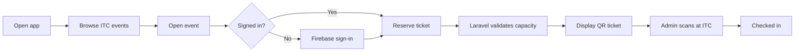
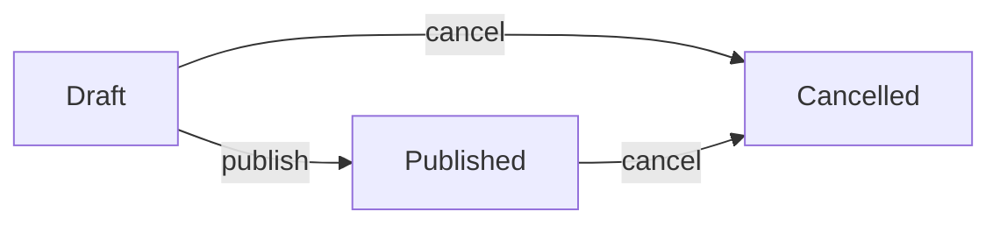
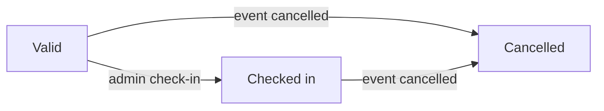
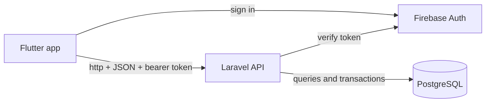

# ITC Event Ticketing MVP - Project Documentation

**Baseline:** Version 2.6 | **Delivery limit:** 10 weeks | **Status:** Scope locked

> This MVP is only for events held at ITC. It has three access states: guest, attendee, and admin. There is no organizer role, no organizer approval, and no support for events outside ITC.

## 1. Project summary

The application publishes free events happening at ITC. A guest can browse events. An attendee can sign in, reserve one place, receive a QR ticket, and view that ticket in the Flutter app. An admin uses the **same Flutter app** with admin-only screens to create, edit, publish, and cancel events, view attendees, scan QR tickets, and enter ticket codes manually when the camera cannot be used. Laravel provides a REST API only — there is no separate web admin panel.

| Item | Fixed decision |
| --- | --- |
| Institution | ITC only |
| Event type | Free events only |
| Ticket type | One General Admission ticket per event |
| Roles | Guest, attendee, admin |
| Client | Flutter mobile app (attendee + admin screens; minimal semi-flat card UI — see §10.2) |
| State, DI, and routing | GetX |
| HTTP client | Dart/Flutter `http` package |
| Authentication | Firebase email/password, Google, and phone/SMS |
| Backend | Laravel REST API (no Filament, no web admin UI) |
| Admin interface | Flutter admin-only screens in the same app (see §10.7) |
| Database | PostgreSQL |
| Team | 2 beginner/intermediate developers, about 20 hours/week each |
| Dev environments | Mac + **iOS Simulator**; Windows + **Android Emulator** (see §1.2) |
| Deadline | 10 weeks maximum |

### 1.1 Scope rule

The features in this document are the complete MVP. During the ten-week implementation period, do not add or propose additional product features. A mandatory change must replace existing work rather than increase the scope.

Engineering work such as tests, validation, logging, migrations, documentation, and security checks is required to make the fixed features reliable; it is not additional product scope.

### 1.2 Development environment

The team develops on two machines with different primary simulators. Both developers run the full stack locally (Laravel, PostgreSQL, Flutter) on their own computer.

| Developer | Host OS | Primary Flutter target | Laravel API host URL (from app) |
| --- | --- | --- | --- |
| Developer A | macOS | iOS Simulator | `http://127.0.0.1:8000` (or `http://localhost:8000`) |
| Developer B | Windows | Android Emulator | `http://10.0.2.2:8000` |

**Rules**

- Do not hardcode one API base URL in source. Use a single config value (for example `--dart-define=API_BASE_URL=...`, a `.env` file ignored by git, or a small `app_config.dart` per developer) so Mac/iOS and Windows/Android each reach the local Laravel server correctly.
- `10.0.2.2` is the Android Emulator’s alias for the Windows host loopback. It does **not** work on iOS Simulator or on a physical phone.
- Each developer runs their own PostgreSQL database during daily work. Share schema through migrations and seeders in git — not by sharing a live database connection.
- Register **both** an Android app and an iOS app in the same Firebase project. Developer A configures iOS; Developer B configures Android (SHA-1 fingerprint, `google-services.json`).
- Daily development uses the assigned simulator above. Before Week 10 demo, each developer also runs the app once on the **other** platform (Android on Windows, iOS on Mac) and tests phone/SMS auth and QR scanning on at least one **physical device** per platform where the simulator cannot fully substitute (camera/scanner, real SMS).

**Platform notes**

- **iOS Simulator (Mac):** Google Sign-In and most API flows work; QR scanning and phone/SMS may need a physical iPhone for final verification.
- **Android Emulator (Windows):** Use `10.0.2.2` for Laravel; enable emulator camera or use a physical Android device for scanner testing in later weeks.
- **Cross-machine API testing (optional):** To call a teammate’s Laravel instance on the LAN, use the host machine’s local network IP (for example `http://192.168.1.10:8000`) and ensure Laravel binds to `0.0.0.0` for that test only. Default daily work stays on localhost per machine.

## 2. Fixed MVP scope

### 2.1 Included

- Browse upcoming published ITC events without signing in.
- View event details, including date, time, ITC room/building, and remaining places.
- Sign in with Firebase email/password, Google, or phone number with an SMS verification code.
- Link additional sign-in methods to the currently authenticated Firebase account so they share one UID and one ticket history.
- Reserve one free ticket per attendee per event.
- Enforce event capacity without overselling.
- View upcoming, past, and cancelled tickets.
- Display an opaque QR ticket in Flutter.
- Let an admin create, edit, publish, and cancel all events through Flutter admin screens.
- Let an admin view attendees and reservation/check-in counts on the event detail screen in Flutter (no separate analytics dashboard).
- Provide admin-only QR scanner and manual ticket-code check-in screens in Flutter.
- Handle loading, empty, validation, sold-out, cancelled, and duplicate-scan states.

### 2.2 Excluded

- Organizer accounts, organizer approval, event ownership, and organizer-specific dashboards.
- Events outside ITC, multiple institutions, city search, maps, geolocation, and directions.
- Payments, refunds, discount codes, invoices, or paid ticket types.
- Multiple ticket tiers, assigned seating, waitlists, transfers, or resale.
- Event images, file uploads, push notifications, and email confirmations.
- Apple sign-in, social sharing, public campaigns, and deep links.
- Offline reservation, offline check-in, and offline ticket synchronization.
- A separate admin mobile application (admin features live in the same Flutter app, gated by `is_admin`).
- A web or desktop admin panel (Filament, custom Laravel admin, or similar).
- Custom admin dashboards, charts, widgets, bulk actions, CSV export, global search, wizards, or rich-text editors.
- Automatic merging of two Firebase accounts that were already created separately.

## 3. Roles and authorization

| Role | Meaning | Allowed actions |
| --- | --- | --- |
| Guest | A person who is not signed in. This is not stored as a database role. | Browse published upcoming events and open event details. |
| Attendee | A signed-in Firebase user with `is_admin = false`. | Manage own profile, reserve a ticket, and view only their own tickets. |
| Admin | A trusted ITC staff account with `is_admin = true`. | Manage every event, view attendees, and check in any valid ITC ticket. |

### 3.1 Authorization rules

- Firebase proves the user's identity.
- PostgreSQL stores the application permission through `users.is_admin`.
- Firebase claims do not grant admin access by themselves.
- An attendee's user ID always comes from the verified Firebase token, never from request input.
- An attendee may retrieve only tickets whose `user_id` matches the authenticated user.
- Only an admin may call admin API endpoints or open admin-only Flutter routes (event management, scanner, manual check-in).
- Admin Flutter routes are hidden from non-admin users and independently rejected by Laravel.
- There is no `organizer_id` and no event-ownership policy because every event belongs to the single ITC application.

### 3.2 Multiple sign-in methods

- Firebase assigns a UID to each authenticated account, regardless of whether it uses email/password, Google, or phone/SMS.
- The MVP uses the Firebase UID as the application's identity key.
- Different sign-in methods can create separate Firebase accounts unless those providers are explicitly linked.
- After signing in, the user can open **Profile > Linked sign-in methods** and link Google, phone, or email/password credentials to the current Firebase account.
- Flutter obtains the new provider credential and calls `currentUser.linkWithCredential(credential)` instead of signing in as a new user.
- A successful link preserves the current Firebase UID. Laravel continues resolving the same PostgreSQL user and the same ticket history.
- The app handles `provider-already-linked`, `credential-already-in-use`, invalid credentials, and expired SMS codes with explicit messages.
- If Firebase returns `credential-already-in-use`, the app does not merge accounts. It instructs the user to sign out and use the account that already owns that credential.
- The one-ticket rule remains enforced per Firebase account. Correct linking prevents one person from unintentionally creating separate ticket histories with different providers.

### 3.3 Real account-linking scenario

Dara first registers with email/password and receives Firebase UID `USER_A123`. Laravel creates PostgreSQL user `DB_USER_1`, and Dara reserves a ticket for an ITC event.

Later, while still signed in as `USER_A123`, Dara opens **Linked sign-in methods**, chooses **Link phone**, verifies the SMS code, and Flutter calls `linkWithCredential()`. Firebase attaches the phone credential to `USER_A123`.

```text
Firebase UID: USER_A123
Linked providers:
  - Email/password: dara@student.itc.edu.kh
  - Phone: +85512345678

Laravel user: DB_USER_1
Ticket history: unchanged
```

Dara can now sign in using email/password or the linked phone number. Both methods return `USER_A123`, so Laravel loads `DB_USER_1` and the same tickets.

If Dara had already used the phone number to create another Firebase account, linking would return `credential-already-in-use`. This MVP displays an account-conflict message and does not attempt to move or merge tickets between the two accounts.

### 3.4 Phone authentication setup

- Enable the Phone provider in Firebase Authentication.
- Add the Android app's SHA-1 fingerprint to Firebase (Developer B, Windows/Android).
- Add the iOS app bundle ID and Google Sign-In URL scheme in Firebase and Xcode (Developer A, Mac/iOS).
- Configure APNs, push-notification capability, and background remote notifications for iOS phone auth (Developer A).
- Use Firebase test phone numbers and fixed codes during development so test SMS messages are not sent.
- Test the final phone flow on physical Android and iOS devices before demo week (simulators use Firebase test phone numbers during development).
- Inform users that their phone number is sent to and stored by Google for spam and abuse prevention.

## 4. User flows

### 4.1 Guest and attendee flow



1. The app loads upcoming ITC events from `GET /api/v1/events`.
2. The guest opens an event and selects **Get ticket**.
3. If necessary, the app opens Firebase sign-in and returns to the selected event.
4. The shared `ApiClient` sends the Firebase ID token to Laravel using the `http` package.
5. Laravel validates the event, duplicate-ticket rule, time, and capacity.
6. Laravel returns an existing ticket or creates a new ticket.
7. Flutter displays the opaque ticket code as a QR image.
8. At ITC, the admin scans the code and Laravel records one check-in.

### 4.2 Admin flow

1. The admin signs in to Flutter with Firebase (same flow as attendees).
2. Profile shows an **Admin** section when `/me` returns `is_admin: true`.
3. The admin opens **Manage events**, creates a draft event, and supplies its ITC room/building label.
4. The admin publishes the event; it becomes visible on Home for all users.
5. The admin opens the event to see attendee rows and reservation/check-in counts.
6. At the event, the admin opens **Admin scanner** and scans attendee QR codes.
7. If scanning fails, the admin opens **Manual check-in**, enters the same ticket code, and Laravel records check-in through the same `CheckInService`.

### 4.3 Edge-case behavior

| Situation | Server behavior | App message |
| --- | --- | --- |
| Event full | Return `409 EVENT_FULL`. | Sold out |
| Attendee already has a ticket | Return the existing ticket; do not create another row. | Ticket already reserved |
| Ticket already scanned | Return `409 ALREADY_CHECKED_IN` and the original timestamp. | Already checked in |
| Event cancelled | Reject reservation and check-in. | Event cancelled |
| Event ended | Reject new reservations and late check-in. | Event has ended |
| Non-admin uses scanner endpoint | Return `403 FORBIDDEN`. | Admin access required |
| Unknown ticket code | Return `404 INVALID_TICKET`. | Ticket not found |

## 5. Business logic

### 5.1 Event states



- `draft` is visible only to admins through the admin events API and Flutter admin screens.
- `published` is visible in Flutter and may accept reservations.
- `cancelled` is terminal. A cancelled event is not republished.
- `past` is calculated from time; it is not stored as an event status.
- If `ends_at` is absent, Laravel uses `starts_at + 2 hours` as the effective end time.
- Publishing requires a title, description, future start time, ITC location label, and valid capacity.

### 5.2 Ticket states



- A newly issued ticket is `valid`.
- A successful scan changes it to `checked_in` and records the admin and timestamp.
- Cancelling an event changes its tickets to `cancelled` while preserving any existing check-in audit fields.

### 5.3 Reservation logic

```text
function reserveTicket(eventId, authenticatedAttendee):
    begin transaction
    event = SELECT event WHERE id = eventId FOR UPDATE

    reject 404 if event does not exist
    reject 422 if event.status is not published
    reject 422 if now >= effectiveEndTime(event)

    existing = ticket for (eventId, authenticatedAttendee.id)
    if existing exists:
        commit and return 200 existing ticket

    activeCount = count event tickets
                  where status in (valid, checked_in)
    reject 409 EVENT_FULL if activeCount >= event.capacity

    create valid ticket with an unguessable ticket_code
    commit and return 201 new ticket
```

The event-row lock serializes capacity checks for the same event. The database unique constraint on `(event_id, user_id)` separately prevents duplicate tickets when two requests from the same attendee arrive together.

Remaining capacity is derived rather than stored:

```text
spots_remaining = max(0, capacity - count(valid or checked_in tickets))
```

The number displayed in Flutter is informational. The transaction is the final authority because another attendee may reserve a place between viewing and submitting.

### 5.4 Check-in logic

```text
function checkIn(ticketCode, authenticatedAdmin):
    reject 403 unless authenticatedAdmin.is_admin
    begin transaction

    ticket = SELECT ticket + event
             WHERE ticket_code = code FOR UPDATE

    reject 404 if ticket does not exist
    reject 422 if event.status is not published
    reject 422 if outside the event check-in window
    reject 409 with checked_in_at if ticket is already checked_in
    reject 422 if ticket.status is not valid

    set ticket.status = checked_in
    set ticket.checked_in_at = now UTC
    set ticket.checked_in_by = authenticatedAdmin.id
    commit and return 200
```

The fixed MVP check-in window opens two hours before `starts_at` and closes two hours after the effective event end. Flutter scanning and manual entry must call the same Laravel `CheckInService` so their behavior cannot diverge.

### 5.5 Cancellation logic

1. Begin a database transaction.
2. Lock the event and confirm the user is an admin.
3. Change the event status to `cancelled`.
4. Change all related `valid` and `checked_in` tickets to `cancelled`.
5. Preserve `checked_in_at` and `checked_in_by` for audit history.
6. Commit the transaction.

## 6. Simplified architecture



| Component | Responsibility |
| --- | --- |
| Flutter | Guest browsing, attendee tickets, QR display, admin event management, attendee lists, scanner, manual check-in, and minimal semi-flat card UI (§10.2). |
| GetX | Controllers, reactive UI state, dependency injection, named routes, and route guards. |
| `http` | Small, explicit HTTP client wrapped by `ApiClient` for requests, bearer tokens, timeouts, JSON, and errors. |
| Firebase Auth | Email/password, Google, and phone/SMS identity for all Flutter users (attendees and admin). |
| Laravel API | Token verification, authorization, validation, ticket rules, check-in rules, and admin event lifecycle. |
| PostgreSQL | Users, events, tickets, constraints, locks, and audit timestamps. |

### 6.1 Important separation

- GetX controls what the Flutter interface displays. Visual style comes from one shared theme and reusable widgets (§10.2).
- The `http` package transports requests and responses through one application-owned `ApiClient`.
- Laravel makes every security and business decision. It exposes JSON endpoints only — no server-rendered admin UI.
- Admin and attendee experiences share one Flutter app and one Firebase sign-in flow; `is_admin` unlocks extra routes and API access.
- PostgreSQL provides the durable source of truth.

## 7. Database design

### 7.1 Users

```text
users
  id            UUID PRIMARY KEY
  firebase_uid  VARCHAR UNIQUE NULL
  email         VARCHAR UNIQUE NULL
  phone_number  VARCHAR UNIQUE NULL
  name          VARCHAR NULL
  is_admin      BOOLEAN NOT NULL DEFAULT false
  created_at    TIMESTAMPTZ NOT NULL
  updated_at    TIMESTAMPTZ NOT NULL
```

- Guests have no database row.
- Firebase users are synchronized by `firebase_uid` after authenticated API requests.
- Store the verified Firebase phone number when the selected provider supplies one.
- All sign-in (attendee and admin) uses Firebase only. There is no Laravel password or session login.
- Only admin records have `is_admin = true`.

### 7.2 Events

```text
events
  id              UUID PRIMARY KEY
  title           VARCHAR(120) NOT NULL
  description     TEXT NOT NULL
  starts_at       TIMESTAMPTZ NOT NULL
  ends_at         TIMESTAMPTZ NULL
  location_label  VARCHAR(120) NOT NULL
  capacity        INT NOT NULL CHECK (capacity BETWEEN 1 AND 500)
  status          VARCHAR NOT NULL
                  CHECK (status IN ('draft','published','cancelled'))
  created_at      TIMESTAMPTZ NOT NULL
  updated_at      TIMESTAMPTZ NOT NULL
```

`location_label` contains only the ITC building/room description, such as `Building A - Room 204`. The application does not store city, latitude, longitude, or a separate public address.

### 7.3 Tickets

```text
tickets
  id              UUID PRIMARY KEY
  event_id        UUID NOT NULL REFERENCES events(id)
  user_id         UUID NOT NULL REFERENCES users(id)
  ticket_code     VARCHAR UNIQUE NOT NULL
  status          VARCHAR NOT NULL
                  CHECK (status IN ('valid','checked_in','cancelled'))
  checked_in_at   TIMESTAMPTZ NULL
  checked_in_by   UUID NULL REFERENCES users(id)
  created_at      TIMESTAMPTZ NOT NULL
  updated_at      TIMESTAMPTZ NOT NULL
  UNIQUE (event_id, user_id)
```

### 7.4 Required indexes

- `events(status, starts_at)` for the public event list.
- `tickets(user_id, created_at)` for My Tickets.
- `tickets(event_id, status)` for capacity and attendee totals.
- Unique indexes for `users.firebase_uid`, `tickets.ticket_code`, and `(event_id, user_id)`.

## 8. REST API

**Base URL:** `/api/v1`

**Protected header:** `Authorization: Bearer <firebase_id_token>`

### 8.1 Endpoints

| Method | Endpoint | Access | Purpose |
| --- | --- | --- | --- |
| GET | `/me` | Attendee/admin | Return profile and `is_admin`. |
| PATCH | `/me` | Attendee/admin | Update display name. |
| GET | `/events` | Public | List upcoming published ITC events. |
| GET | `/events/{id}` | Public | Return event detail and `spots_remaining`. |
| POST | `/events/{id}/tickets` | Attendee/admin | Return existing ticket or reserve one place. |
| GET | `/tickets` | Attendee/admin | List the authenticated user's tickets. |
| GET | `/tickets/{id}` | Ticket owner | Return ticket detail and QR payload. |
| GET | `/admin/events` | Admin | List all events (any status), with reserved and checked-in counts. |
| POST | `/admin/events` | Admin | Create a draft event. |
| GET | `/admin/events/{id}` | Admin | Return event detail, counts, and attendee summary fields. |
| PATCH | `/admin/events/{id}` | Admin | Update a draft or published event (not cancelled). |
| POST | `/admin/events/{id}/publish` | Admin | Publish a draft event via `EventLifecycleService`. |
| POST | `/admin/events/{id}/cancel` | Admin | Cancel a draft or published event via `EventLifecycleService`. |
| GET | `/admin/events/{id}/attendees` | Admin | List ticket rows for the event (read-only). |
| POST | `/admin/check-in` | Admin | Validate a ticket code and record check-in. |

Admin endpoints require a valid Firebase token and `is_admin = true`. Non-admin callers receive `403 FORBIDDEN`.

### 8.1.1 Admin event request body (create/update)

| Field | Rules |
| --- | --- |
| `title` | Required, max 120 |
| `description` | Required |
| `starts_at` | Required, ISO 8601 UTC |
| `ends_at` | Optional, ISO 8601 UTC |
| `location_label` | Required, max 120 |
| `capacity` | Required, integer 1–500 |

`status` is never set directly by the client. Use `/publish` and `/cancel` actions instead.

### 8.1.2 Admin check-in request body

```json
{ "ticket_code": "TKT_01JABC123XYZ" }
```

The scanner and manual check-in screens send the same payload to `POST /admin/check-in`.

### 8.2 Response format

```json
{
  "data": {},
  "meta": {
    "request_id": "request-uuid"
  }
}
```

```json
{
  "error": {
    "code": "EVENT_FULL",
    "message": "This event has no remaining places.",
    "fields": {}
  },
  "meta": {
    "request_id": "request-uuid"
  }
}
```

### 8.3 Status codes

| HTTP | Meaning |
| --- | --- |
| 200 | Successful read/update or an existing ticket was returned. |
| 201 | A new ticket was created. |
| 401 | Missing, invalid, or expired Firebase identity. |
| 403 | The signed-in user is not an admin or does not own the requested ticket. |
| 404 | Event, ticket, or ticket code not found. |
| 409 | Event full or ticket already checked in. |
| 422 | Invalid input or event/ticket state does not allow the action. |

## 9. Laravel API design

Laravel is a JSON API only. There is no Filament panel, no Blade admin UI, and no Laravel session login for admins. All admin actions go through the REST endpoints in §8.1 and the same service layer as attendee flows.

### 9.1 Laravel layers

- **Firebase middleware:** verifies ID tokens and resolves the PostgreSQL user.
- **Admin middleware:** rejects non-admin users on `/admin/*` routes with `403`.
- **Form Requests:** validate required fields, lengths, capacity, dates, and status values.
- **Policies/middleware:** enforce ticket ownership and `is_admin`.
- **Controllers:** translate HTTP input and output; they do not contain transaction logic.
- **Services:** `TicketService`, `CheckInService`, and `EventLifecycleService` own business workflows.
- **API Resources:** return stable JSON and prevent accidental field exposure.
- **Database:** enforces constraints and provides transactions and row locks.

### 9.2 Service reuse rule

Flutter admin screens, the scanner, and manual check-in must all call the same Laravel services (`EventLifecycleService`, `CheckInService`, `TicketService`). Controllers must not duplicate reservation, cancellation, or check-in logic.

### 9.3 Admin API response fields

**Event list item (`GET /admin/events`)**

| Field | Notes |
| --- | --- |
| `id`, `title`, `starts_at`, `location_label`, `capacity`, `status` | Same as public event fields plus any status |
| `reserved_count` | Tickets with status `valid` or `checked_in` |
| `checked_in_count` | Tickets with status `checked_in` |

**Attendee row (`GET /admin/events/{id}/attendees`)**

| Field | Notes |
| --- | --- |
| Attendee name | From linked user; fall back to email or phone |
| `ticket_status` | `valid`, `checked_in`, or `cancelled` |
| `issued_at` | Ticket `created_at` |
| `checked_in_at` | Nullable |

## 10. Flutter and GetX design

### 10.1 Screens

| Screen | Access | Responsibility |
| --- | --- | --- |
| Home | Everyone | Upcoming published ITC events. |
| Event detail | Everyone | Event information, remaining places, and ticket action. |
| Sign in | Guest | Firebase email/password, Google, and phone/SMS sign-in. |
| My Tickets | Attendee/admin | Upcoming, past, and cancelled tickets. |
| Ticket detail | Ticket owner | QR code, event summary, status, and check-in time. |
| Profile | Attendee/admin | Name, email/phone, linked sign-in methods, admin section, and sign out. |
| Admin events list | Admin only | All events with status, counts, and navigation to create/edit. |
| Admin event form | Admin only | Create or edit draft/published events; Publish and Cancel actions. |
| Admin event detail | Admin only | Event summary, reserved/checked-in counts, and attendee list. |
| Admin scanner | Admin only | Scan one QR at a time and show the server result. |
| Manual check-in | Admin only | Enter a ticket code when the camera cannot be used. |

### 10.2 Flutter UI direction (minimal semi-flat)

The Flutter app follows a **minimal mobile utility UI**: clean, card-based, semi-flat (Flat 2.0). The reference is a simple presence/attendance-style kit — white cards on a light gray canvas, one primary blue, clear sans-serif type, and functional components. This applies to **all Flutter screens**, including admin.

**Design principles**

- Mobile-first, one primary action per screen.
- Content in **rounded white cards** on a **light gray** scaffold background.
- **Semi-flat:** mostly flat surfaces with light elevation (soft shadow) — no glassmorphism, gradients, or decorative illustration.
- Reuse shared widgets and one theme file; do not style screens independently.

**Color palette**

| Token | Use | Example |
| --- | --- | --- |
| Primary blue | App bar, primary buttons, active nav, links | `#2563EB` or similar |
| Scaffold background | Screen background behind cards | `#F3F4F6` or similar |
| Surface / card | Cards, sheets, input backgrounds | `#FFFFFF` |
| Text primary | Titles, body | `#111827` or similar |
| Text secondary | Subtitles, hints, captions | `#6B7280` or similar |
| Success | Reserved, checked in, success banners | `#16A34A` or similar |
| Error | Validation, sold out, scan failure | `#DC2626` or similar |
| Warning | Event ending soon, duplicate scan info | `#EA580C` or similar |

**Typography**

- Sans-serif only: Flutter default **Roboto** or **Inter** via `google_fonts`.
- Title: 18–20 pt, semi-bold.
- Body: 14–16 pt, regular.
- Caption / label: 12–13 pt, medium gray.

**Core components** (implement once, reuse everywhere)

| Component | Use |
| --- | --- |
| `AppCard` | Event rows, ticket rows, QR container, profile sections |
| `PrimaryButton` | Full-width rounded blue button (Get ticket, Sign in, Reserve) |
| `SecondaryButton` | Outline or light gray actions (Cancel, Back) |
| `AppTextField` | Login, profile name, phone verification |
| `ListMenuRow` | Profile menu: linked sign-in methods, admin section entries, sign out |
| `StatusBanner` | Inline success, error, and warning feedback |
| `EmptyStateView` | No events, no tickets, sold out |
| `LoadingView` | Centered indicator while API calls are in flight |

**Navigation**

- **Bottom navigation bar** with three tabs: **Home**, **My Tickets**, **Profile**.
- **Top app bar** on inner screens: back arrow, screen title, no extra actions unless required.
- **Admin section** on Profile (visible only when `/me` returns `is_admin: true`): **Manage events**, **Admin scanner**, **Manual check-in**. Not main tabs.
- Event detail opens from Home as a pushed screen (not a tab).
- Admin event form and attendee list open as pushed screens from the admin events list.

**Screen layout notes**

| Screen | Layout |
| --- | --- |
| Home | Scrollable list of event cards: title, date/time, location label, spots remaining |
| Event detail | Summary card + sticky bottom **Get ticket** primary button |
| Sign in | Centered title, stacked inputs, primary sign-in button, secondary provider buttons |
| My Tickets | Tabs or segments: Upcoming / Past / Cancelled; each row is a ticket card |
| Ticket detail | Large QR card centered, event summary card below, status chip |
| Profile | Avatar circle, name, admin badge, list-style rows for linked sign-in methods, admin section, and sign out |
| Admin events list | Scrollable event cards with status chip, date, location, reserved/checked-in counts; FAB or app-bar **Create** |
| Admin event form | Stacked `AppTextField` / date pickers in cards; **Save**, **Publish** (draft only), **Cancel event** actions |
| Admin event detail | Summary card with counts + scrollable attendee list (read-only rows) |
| Admin scanner | Camera viewfinder, result banner below; no extra chrome |
| Manual check-in | Single ticket-code field, **Check in** primary button, result banner |

**Feedback patterns**

- **Loading:** disable the triggering button and show a small inline progress indicator.
- **Success / error / warning:** `StatusBanner` or snackbar — same colors as the palette above.
- **Confirmations:** simple alert dialog (e.g. sign out, cancel event, publish event).
- **Empty states:** icon + short message + optional retry action.

**File structure**

```text
mobile/lib/
├── app/
│   ├── theme/app_theme.dart      # ColorScheme, TextTheme, button and card styles
│   └── widgets/                  # AppCard, PrimaryButton, AppTextField, etc.
└── modules/
    ├── events/                   # Public attendee event flows
    ├── tickets/
    ├── auth/
    └── admin/                    # Admin events, attendees, scanner, manual check-in
```

**Out of scope for UI polish**

- Custom illustrations, Lottie animations, onboarding carousels, or splash marketing art.
- Event images, maps, or location previews (product scope already excludes these).
- Custom icon packs beyond Material Icons.
- Dark mode (optional post-MVP; do not implement during the ten-week window unless time remains in Week 9).

### 10.2.1 Figma prototype polish (baseline → hi-fi)

The Figma file is a **layout baseline** first. A second pass adds icons, placeholder visuals, and realistic sample copy. Use **Material Icons** (or SVG equivalents) and the palette in §10.2.

**Global assets**

| Asset | Use |
| --- | --- |
| Bottom nav icons | `home`, `confirmation_number` (ticket), `person` — active = primary blue, inactive = gray |
| App bar back | `arrow_back` on inner screens |
| List chevron | `chevron_right` on Profile menu rows |
| Loading | Small circular progress on buttons while submitting |
| Empty states | `event_busy`, `confirmation_number` off, `error_outline` with short message |

**Per-screen placeholders**

| Screen | Icons | Placeholder visuals | Sample copy |
| --- | --- | --- | --- |
| Home | Calendar, location pin, people on each event card | — | Realistic ITC event titles, dates, room labels, `42 of 50 spots left` / `Sold out` |
| Event detail | Same meta icons in summary card | Light blue **ITC header strip** (logo circle + “ITC”) — not a photo | Full description paragraph, sticky **Get ticket** CTA |
| Sign in | `mail`, `lock` inside fields; Google / phone on provider buttons | ITC logo circle above title | `you@student.itc.edu.kh`, helper text under title |
| My Tickets | Status chip icons (`check_circle`, `cancel`) | — | Segments Upcoming / Past / Cancelled; ticket cards with event name + status |
| Ticket detail | — | **QR code pattern** (grid placeholder, not real code) + monospace `TKT_01JABC123XYZ` | Event summary, `Status: Valid`, helper “Show at entrance” |
| Profile | Row icons: `edit`, `link`, `event_note`, `qr_code_scanner`, `keyboard`, `logout` | **Avatar** circle with initials `DS` (or generic person silhouette) | Name, email, Admin badge, admin section subtitle |
| Admin events list | Status chip, calendar, location | — | Draft / Published / Cancelled; `12 reserved · 8 checked in` |
| Admin event form | Date/time pickers | — | Same fields as API; **Publish** on draft |
| Admin event detail | Attendee status chips | — | Counts header + attendee name rows |
| Admin scanner | Viewfinder corners | Dark camera area + scan frame; green **success banner** with check icon | “Point camera at attendee QR code”, sample success message |
| Manual check-in | `confirmation_number` in field | — | Enter code fallback when camera fails |

**Prototype linking (optional)**

- Home card → Event detail → Get ticket → Sign in → Ticket detail  
- Profile → Manage events → Event form → Publish → Home (event visible)  
- Profile → Admin scanner / Manual check-in (admin only)  
- My Tickets row → Ticket detail  

**Figma file:** [ITC Events — App Prototype](https://www.figma.com/design/6HdzvW3Hq6o7UxxjjcwtkC) (new empty file — import from HTML below)

**Interactive prototype (source of truth for v2):** [`docs/prototype/itc-app-prototype.html`](prototype/itc-app-prototype.html) — open in browser or `http://localhost:8765/itc-app-prototype.html` when local server is running.

| Page / section | Purpose |
| --- | --- |
| Discover flow | Welcome → Home (featured hero, search, chips) → Event detail sheet |
| Book flow | Sign-in bottom sheet → Reservation success |
| Ticket wallet | Wallet cards → Full QR at door |
| Profile & admin | Stats, admin strip → Scanner success / duplicate |
| Edge states | Empty tickets, sold out, loading |

**Import into Figma:** open the Figma file → add pages per flow → use **html.to.design** plugin on each flow section from the HTML preview, or ask agent to push when MCP limit resets.

**Note:** Event **photos** stay out of scope (§2.2). Use gradients, featured cards, and ITC brand strips instead.

### 10.3 GetX structure

- `AuthController`: Firebase session, email/password, Google, phone/SMS verification, provider linking, account-conflict errors, `/me`, and sign-out.
- `EventController`: public event list, event detail, loading, and errors.
- `TicketController`: reservation, My Tickets, and ticket details.
- `AdminEventController`: admin events list, create/edit form, publish, cancel, and attendee list.
- `AdminCheckInController`: scanner and manual check-in state, submission, and result feedback.
- GetX `Bindings`: create route-specific controllers and shared services.
- `Obx`: render reactive loading, data, and error states.
- `GetMaterialApp` and named `GetPage` routes: navigation and admin route guards (redirect non-admin users away from `/admin/*` routes).

Keep route-specific controllers disposable. Keep only shared services such as `AuthService` and `ApiClient` alive for the application session.

### 10.4 HTTP `ApiClient` responsibilities

- Own one reusable `http.Client` rather than creating a new client for every request.
- Build request URIs from one configured Laravel API base URL.
- Encode request bodies and decode response bodies as JSON.
- Attach `Content-Type: application/json` and the current Firebase ID token to protected requests.
- Apply a Dart `timeout` to each request and convert network failures into typed application errors.
- Convert Laravel error codes into typed Flutter failures.
- On one `401`, force-refresh the Firebase token and retry once.
- If the second attempt returns `401`, sign the user out.
- Close the client when the application service is disposed.
- Never log bearer tokens or complete ticket codes in production.

### 10.5 Why `http` instead of Dio

The MVP has about fifteen REST endpoints, JSON request/response bodies, and no file uploads, download progress, caching, or complex request cancellation. The `http` package is sufficient and introduces fewer concepts for a beginner team.

Dio would provide built-in interceptors, richer configuration, cancellation, and upload/download helpers. Those capabilities are useful in more complex networking layers, but this project does not require them. With `http`, the team must explicitly implement token attachment and the single retry inside `ApiClient`; that small amount of code is acceptable for this scope.

### 10.6 Packages

| Responsibility | Package / SDK |
| --- | --- |
| Authentication | `firebase_core`, `firebase_auth`, `google_sign_in` |
| State, dependency injection, routing | `get` |
| HTTP | `http` |
| Typography (optional) | `google_fonts` — Inter, if not using Roboto default |
| QR display | `qr_flutter` |
| QR scanning | `mobile_scanner` |

Pin compatible versions in `pubspec.lock` during Week 1. Do not change major package versions during the project unless a blocking defect or security problem requires it.

### 10.7 Flutter admin UI policy (minimal)

Admin screens use the same theme, widgets, and card layout as attendee screens (§10.2). Keep them functional — not a separate design system.

**Build**

- Reuse `AppCard`, `PrimaryButton`, `SecondaryButton`, `AppTextField`, `StatusBanner`, `EmptyStateView`, and `LoadingView`.
- Admin events list with status filter (optional) and create action.
- Event form with plain text fields and date/time pickers — no rich-text editor.
- Publish and Cancel event as confirmation dialogs calling the admin API.
- Read-only attendee list on event detail.
- Scanner and manual check-in sharing one `AdminCheckInController` result pattern.

**Do not build**

- Separate admin app, admin bottom tab, or custom admin theme.
- Charts, analytics dashboards, bulk actions, CSV export, or user-management screens.
- Inline attendee edit/delete or ticket manipulation beyond check-in.

If time slips during implementation, simplify admin form validation messages and list polish first — never skip authorization, publish/cancel rules, or check-in parity with the API.

- The QR contains only an opaque, high-entropy ticket code such as `TKT_01JABC123XYZ`.
- The QR never contains a name, email address, Firebase UID, or event details.
- Laravel validates the code, event state, ticket state, admin role, and check-in time window.
- All deployed traffic uses HTTPS.
- Tokens, passwords, Firebase service credentials, and database credentials are never committed to source control.
- Production logs redact authorization headers and show only shortened ticket references.
- Admin-only Flutter routes and `/admin/*` API endpoints are hidden from non-admin users and independently rejected by Laravel with `403`.

## 12. Testing requirements

### 12.1 Laravel tests

| Area | Required checks |
| --- | --- |
| Authentication | Valid token maps a user; invalid/missing token returns 401; `is_admin` comes from PostgreSQL. |
| Public events | Only published, not-ended ITC events are returned. |
| Ticket ownership | A user cannot read another attendee's ticket. |
| Reservation | Create once, return existing on duplicate, reject full/cancelled/ended event. |
| Concurrency | Simultaneous reservations never exceed capacity. |
| Cancellation | Event and related tickets update atomically. |
| Admin events | Non-admin 403; create draft; publish validates fields; cancel is atomic. |
| Admin attendees | Non-admin 403; returns read-only ticket rows for the event. |
| Check-in | Valid code succeeds; repeat 409; unknown 404; non-admin 403; closed window 422. |

### 12.2 Flutter tests

- Test API error-code mapping.
- Test UTC-to-local date formatting.
- Widget-test Home loading, empty, error, and data states.
- Widget-test the sign-in gate and disabled reservation button while submitting.
- Widget-test that a non-admin cannot open admin routes (events list, scanner, manual check-in).
- Widget-test admin event form validation and publish confirmation dialog.
- Test that successfully linking a second provider preserves the original Firebase UID and Laravel user.
- Test `provider-already-linked` and `credential-already-in-use` messages without modifying ticket data.
- Manually test email/password, Google, and phone/SMS sign-in; invalid/expired SMS codes; QR readability; camera permission denial; successful scan; and duplicate scan on **both** platforms (primary: iOS Simulator on Mac, Android Emulator on Windows; confirm on physical devices before release).

## 13. Ten-week implementation plan

The team has approximately 40 team-hours per week. Weeks 1-8 complete the product. Weeks 9-10 protect the deadline through integration, defect fixing, documentation, and demo preparation.

| Week | Focus | Exit gate |
| --- | --- | --- |
| 1 | Repository, Laravel/PostgreSQL, Flutter, GetX, `http`, dev environments (§1.2) | Each developer’s simulator calls `GET /api/v1/health` and displays Backend connected. |
| 2 | Firebase email/password and Google auth; user synchronization; `is_admin` | Email/password and Google users call `/me`; seeded admin sees admin section on Profile. |
| 3 | Phone/SMS authentication, provider linking, conflict handling, and auth tests | A linked provider preserves the UID; already-used credentials show a safe conflict message. |
| 4 | Event migration/model, admin events API, Flutter Home, detail, and admin events list | Admin creates and publishes an event from Flutter; it displays on Home. |
| 5 | Transactional reservation API and tests | Duplicate and concurrent requests cannot create extra tickets. |
| 6 | My Tickets, ticket detail, and QR display | Attendee reserves once and displays a scannable QR. |
| 7 | Cancellation API, admin event form, attendee list, manual check-in screen | Cancellation is atomic; admin edits events and sees attendees in Flutter. |
| 8 | Admin check-in API, Flutter scanner, and end-to-end integration | First scan succeeds; duplicate scan is rejected; complete journey passes. |
| 9 | Authorization audit, performance checks, UX errors, regression | No P0/P1 defects; feature freeze is active. |
| 10 | Demo seeds, release build, documentation, rehearsal, contingency | Repeatable ITC demo and definition of done approved. |

### 13.1 Time-protection rules

- Week 8 is the final feature-completion deadline.
- Weeks 9-10 contain no new product functionality.
- Assign one developer as backend/data primary and one as Flutter primary for each weekly goal.
- Pair on the API contract and end-to-end integration.
- If time slips, reduce optional Flutter polish (animations, spacing tweaks) first; keep the shared theme and reusable widgets from §10.2.
- Do not add admin charts, bulk tools, or extra admin screens beyond §10.7.
- Do not remove authentication, authorization, transactions, or critical tests to recover time.

## 14. Where to start

Do not start with QR scanning or a complete user interface. Start with the smallest connection from Flutter to Laravel.

### Step 1 - Create the repository

```text
itc-event-ticketing/
├── backend/       # Laravel REST API only
├── mobile/        # Flutter, GetX, and http
└── docs/
    └── document.md
```

### Step 2 - Prove Laravel and PostgreSQL work

1. Create the Laravel application.
2. Connect PostgreSQL.
3. Run one migration.
4. Add `GET /api/v1/health`.
5. Return `{ "status": "ok" }`.

### Step 3 - Prove Flutter and HTTP work

1. Create and run the Flutter application.
2. Add GetX and the `http` package.
3. Create one `ApiClient` wrapping a reusable `http.Client` and the Laravel base URL from config (§1.2).
4. Call `/api/v1/health`.
5. Display **Backend connected**.

**API base URL by simulator**

| Machine | Simulator | Laravel base URL |
| --- | --- | --- |
| Mac | iOS Simulator | `http://127.0.0.1:8000/api/v1` |
| Windows | Android Emulator | `http://10.0.2.2:8000/api/v1` |

Run Laravel with `php artisan serve` on the same machine as the simulator. If the health check fails, verify the URL matches §1.2 before debugging auth or business logic.

### Step 4 - Complete the first real milestone

1. Configure Firebase email/password and Google sign-in.
2. Sign in from Flutter.
3. Obtain the Firebase ID token.
4. Make `ApiClient` attach the token to protected requests.
5. Verify the token in Laravel.
6. Find or create the PostgreSQL user.
7. Return that user from `GET /api/v1/me`.

The Week 2 milestone is complete when:

> A person signs in through Flutter, `ApiClient` sends the Firebase token to Laravel, Laravel verifies it, creates or finds the PostgreSQL user, and `/me` returns the attendee/admin profile.

### Step 5 - Add phone authentication and provider linking

1. Enable Firebase Phone Authentication and complete Android/iOS platform configuration.
2. Implement SMS verification with Firebase test phone numbers first.
3. Add **Linked sign-in methods** to Profile.
4. While the user is signed in, obtain the new provider credential without completing a second sign-in.
5. Call `currentUser.linkWithCredential(credential)`.
6. Reload the Firebase user and confirm the UID did not change.
7. Call `/me` and confirm Laravel returns the same PostgreSQL user and tickets.
8. Handle `provider-already-linked` and `credential-already-in-use` without attempting data merging.

The Week 3 milestone is complete when:

> An attendee links a second provider, signs out, signs in using the newly linked method, and sees the same account and ticket history.

## 15. Definition of done

### 15.1 Functional

- A guest can browse only published upcoming ITC events.
- An attendee can sign in with email/password, Google, or phone/SMS.
- An attendee can link another sign-in method and retain the same Firebase UID, PostgreSQL user, and tickets.
- A credential that belongs to another Firebase account produces a safe conflict message and does not merge or corrupt ticket data.
- An attendee can reserve exactly one ticket per event until capacity is reached.
- An attendee can view their tickets and QR code.
- The admin can create, edit, publish, and cancel every event through Flutter admin screens.
- The admin can view attendees and reservation/check-in counts on the admin event detail screen.
- The admin can scan a valid ticket in Flutter or enter its code on the manual check-in screen.
- Duplicate scans, full events, cancelled events, ended events, and invalid codes produce the documented result.

### 15.2 Technical

- Migrations, constraints, indexes, and seeders work from a clean database.
- Firebase tokens are verified on every protected API request.
- Provider-linking tests confirm that a successful link preserves identity and that account conflicts do not change application data.
- Admin permission comes from PostgreSQL `is_admin` and is enforced on every `/admin/*` route.
- Ticket reservation, cancellation, and check-in use transactions.
- Flutter admin screens follow the minimal semi-flat UI direction in §10.2 and §10.7 using shared theme and widgets.
- Critical Laravel feature tests and Flutter unit/widget tests pass.
- Flutter builds and runs on **iOS Simulator (Mac)** and **Android Emulator (Windows)**; physical-device smoke tests pass before demo.
- No secrets, bearer tokens, or personal information appear in source control or QR payloads.
- Setup, environment, API base URL config, seed, demo, and release instructions are complete for both Mac/iOS and Windows/Android (§1.2).
- All P0/P1 defects are closed.

### 15.3 Final release boundary

> The MVP is complete when the functional and technical criteria above pass. The system serves ITC events only, with guest, attendee, and admin access. No organizer or multi-location behavior belongs in this release.
